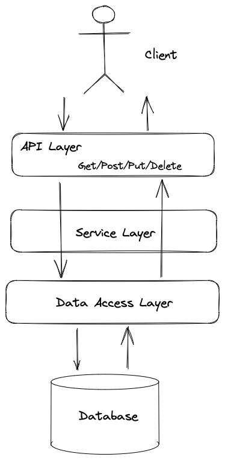
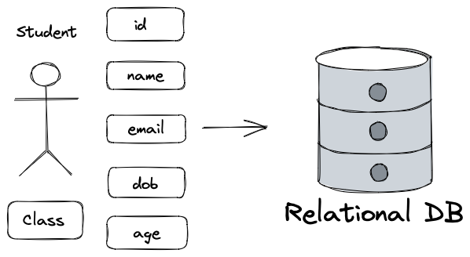
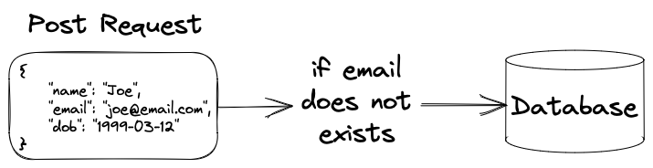

## Student Managment System

### 项目概览（SpringBoot + Spring Data JPA + PostgreSQL）



### 学生类（Student Class）



创建模型（与数据表关联的类）：

-   通过 `@Entity` 修饰符将类修饰成实例。
-   利用 `@GeneratedValue()` 修饰符来指定产生主键的方式，PostgreSQL 使用 `GenerationType.SEQUENCE`，而 MySQL 则使用`GenerationType.IDENTITY`。
-   通过 `@Id` 将变量 `id` 修饰为主键。
-   使用`@Transient`修饰符，使得该变量属于该模型但不存在于数据表中（非持久化）。一旦变量被 `@Transient` 修饰，变量将不再是对象持久化的一部分，该变量内容在序列化后无法获得访问。

```java
@Entity
@Table
public class Student {
    @Id
    @SequenceGenerator(
            name = "student_sequence",
            sequenceName = "student_sequence",
            allocationSize = 1
    )
    @GeneratedValue(
            strategy = GenerationType.SEQUENCE,
            generator = "student_sequence"
    )
    private Long id;
    private String name;
    private String email;
    private LocalDate dob;
    @Transient
    private Integer age;

    public Student() {
    }

    public Student(Long id, String name, String email, LocalDate dob) {
        this.id = id;
        this.name = name;
        this.email = email;
        this.dob = dob;
    }

    public Student(String name, String email, LocalDate dob) {
        this.name = name;
        this.email = email;
        this.dob = dob;
    }

    public Long getId() {
        return id;
    }

    public void setId(Long id) {
        this.id = id;
    }

    public String getName() {
        return name;
    }

    public void setName(String name) {
        this.name = name;
    }

    public String getEmail() {
        return email;
    }

    public void setEmail(String email) {
        this.email = email;
    }

    public LocalDate getDob() {
        return dob;
    }

    public void setDob(LocalDate dob) {
        this.dob = dob;
    }

    public Integer getAge() {
        return Period.between(this.dob, LocalDate.now()).getYears();
    }

    public void setAge(Integer age) {
        this.age = age;
    }

    @Override
    public String toString() {
        return "Student{" +
                "id=" + id +
                ", name='" + name + '\'' +
                ", email='" + email + '\'' +
                ", dob=" + dob +
                ", age=" + age +
                '}';
    }
}
```

### 应用程序接口层（API Layer）

提供与前端交互的接口：

-   `@RestController` = `@Controller` + `@ResponseBody`，即实例化该类并接受 API 接口返回的数据。
-   `@Controller` 将当前修饰的类注入 SpringBoot IOC 容器，使得从该类所在的项目跑起来的过程中，这个类就被实例化。
-   `@ResponseBody` 指该类中所有的 API 接口返回的数据。

```java
@RestController
@RequestMapping(path = "api/v1/student")
public class StudentController {
    private final StudentService studentService;

    @Autowired
    public StudentController(StudentService studentService) {
        this.studentService = studentService;
    }

    @GetMapping
    public List<Student> getStudents() {
        return studentService.getStudents();
    }
}
```

### 业务层（Service Layer）

接受接口请求并进行相应处理：

-   利用 DI（依赖注入）关联至数据访问层。

```java
@Service
public class StudentService {
    private final StudentRepository studentRepository;

    @Autowired
    public StudentService(StudentRepository studentRepository) {
        this.studentRepository = studentRepository;
    }

    public List<Student> getStudents() {
        return studentRepository.findAll();
    }
}
```

### 数据访问层（Data Access Layer）

与数据库进行交互：

-   创建一个接口继承数据库操作工具类 `JpaRepository`，传入模型类名和该模型主键的元素类型，最后通过 `@Repository` 修饰为 数据访问层。

```java
@Repository
public interface StudentRepository extends JpaRepository<Student, Long> {

}
```

### 预设置类（Config）

在后端启动时立即对数据表进行设置（比如增加几条数据）：

-   如果没有通过 `@Bean` 修饰为 `bean`，那么 `CommandLineRunner` 将会无视它，使得被封装的操作无法被自动执行。
-   一个操作对应一个 `CommandLineRunner`。
-   将操作以 lamda 的方式封装在 `CommandLineRunner` 对象中，使得这个对象在被修饰为 `Bean`  的前提下，后端启动时能够自动运行这些操作。

```java
@Configuration
public class StudentConfig {
    @Bean
    CommandLineRunner commandLineRunner(StudentRepository repository) {
        return args -> {
            Student john = new Student("John", "john@email.com", LocalDate.of(2000, Month.JANUARY, 1));
            Student jerry = new Student("Jerry", "jerry@email.com", LocalDate.of(2001, Month.JANUARY, 1));
            Student bob = new Student("Bob", "bob@email.com", LocalDate.of(2002, Month.JANUARY, 1));
            repository.saveAll(
                    List.of(john, jerry, bob)
            );
        };
    }
}
```

### 添加数据业务（Post）



每一个请求（Get、Post、Put、Delete）对应一个接口，而接口都定义在在应用程序接口层：

-   `@PostMapping = @RequestMapping(method = RequestMethod.POST)`
-   `@RequestBody` 将请求体中的 JSON 按模型类的成员变量名整合，传递到模型的构造函数中，从而创建一个实例。

```java
@PostMapping
public void RegisterNewStudent(@RequestBody Student student) {
    studentService.addNewStudent(student);
}
```

在业务层中，判断 Email 地址是否重复，如果不重复保存至数据表：

-   在 `application.properties` 中添加：`server.error.include-message=always`。
-   如果重复，返回 HTTP message：`Student already exists`。

```java
public void addNewStudent(Student student) {
  	Optional<Student> studentOptional = studentRepository.findStudentByEmail(student.getEmail());
  	if (studentOptional.isPresent()) {
    		throw new IllegalArgumentException("Student already exists");
  	}
  	studentRepository.save(student);
}
```

在数据访问层中设置逻辑处理：

-   数据访问层负责对数据表进行增删查改。
-   `Optional<Student> findStudentByEmail(String email)` 等同于 `@Query("SELECT s FROM Student s WHERE s.email = ?1")`，前者继承 JpaRepository 的 DAO 直接定义，后者是用 Jpa 原生 SQL `@Query("")` 定义。

```java
@Repository
public interface StudentRepository extends JpaRepository<Student, Long> {
    Optional<Student> findStudentByEmail(String email);
}
```

### 删除数据业务（Delete）

在应用程序接口层定义 `Delete` 接口：

-   `@DeleteMapping = @RequestMapping(method = RequestMethod.DELETE)`
-   通过序号 `id` 来指定被删除的学生。
-   发送 Delete 请求：`Delete http://localhost:8080/api/v1/student/1`，即删除 ID 为 1 的学生。

```java
@DeleteMapping(path = "{studentId}")
public void deleteStudent(@PathVariable("studentId") Long studentId) {
		studentService.deleteStudent(studentId);
}
```

在业务层中判断 ID 是否存在：

```java
public void deleteStudent(Long studentId) {
    boolean exists = studentRepository.existsById(studentId);
    if (!exists) {
        throw new IllegalArgumentException("Student with id " + studentId + " does not exist");
    }
    studentRepository.deleteById(studentId);
}
```

### 更新已有数据业务（Put）

在应用程序接口层定义 `Put` 接口：

-   `@PutMapping = @RequestMapping(method = RequestMethod.PUT)`
-   发送 Put 请求：`Put http://localhost:8080/api/v1/student/1?name=Johnny&email=johnny@email.com`，即修改 ID 为 1 的学生名为 `Johnny`，并修改其 Email 为 `johnny@email.com`。

```java
@PutMapping(path = "{studentId}")
public void updateStudent(
        @PathVariable("studentId") Long studentId,
        @RequestParam(required = false) String name,
        @RequestParam(required = false) String email) {
    studentService.updateStudent(studentId, name, email);
}
```

在业务层中实现修改数据业务：

-   通过 `@Transactional` 在操作数据表时，可以直接通过模型已经定义好了的 Setters 进行赋值，而不用额外写 SQL 语句。

```java
@Transactional
public void updateStudent(Long studentId, String name, String email) {
    Student student = studentRepository.findById(studentId)
            .orElseThrow(() -> new IllegalStateException("Student with id " + studentId + " does not exist"));

    if (name != null && name.length() > 0 && !Objects.equals(student.getName(), name)) {
        student.setName(name);
    }
    if (email != null && email.length() > 0 && !Objects.equals(student.getEmail(), email)) {
        Optional<Student> studentOptional = studentRepository.findStudentByEmail(email);
        if (studentOptional.isPresent()) {
            throw new IllegalArgumentException("email already taken");
        }
        student.setEmail(email);
    }
}
```

### 属性配置（application.properties）

在基于 SpringBoot 搭建应用时，SpringBoot 会自动在 `resources` 目录包含一个 `application.properties` 文件来作为该应用的默认属性配置文件，此文件的内容不需要使用 `@PropertySource` 注解引入也可以生效：

-   `spring.jpa.hibernate.ddl-auto` 是数据表的更新方式，`create-drop` 是每次程序结束的时候会删除表，启动后创建，在开发时使用，`update` 则是每次运行程序时表内有数据不会清空，只会更新，正常运行时使用。

```properties
spring.datasource.url=jdbc:postgresql://localhost:5432/student
spring.datasource.username=postgres
spring.datasource.password=password
spring.jpa.hibernate.ddl-auto=create-drop
spring.jpa.show-sql=true
spring.jpa.properties.hibernate.dialect=org.hibernate.dialect.PostgreSQLDialect
spring.jpa.properties.hibernate.format_sql=true

server.error.include-message=always
```

### 打包（jar）

使用 `Maven install` 即可打包，在 `jar `包同目录下运行：

```bash
java -jar demo-0.0.1-SNAPSHOT.jar --server.port=80
```

